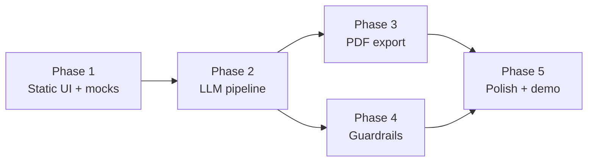

# Resume Shapeshifter — Phase-Wise Implementation Plan

**Version:** 1.0  
**Source:** [problemStatement.md](./problemStatement.md)

This document expands **§15 Suggested Initial Implementation Plan** and **§18 Cursor Development Instructions** into actionable phases with tasks, deliverables, acceptance criteria, and exit gates.

---

## Table of Contents

1. [Overview](#1-overview)
2. [Guiding Principles](#2-guiding-principles)
3. [Tech Stack](#3-tech-stack)
4. [Phase Summary](#4-phase-summary)
5. [Phase 1 — Static Prototype](#5-phase-1--static-prototype)
6. [Phase 2 — LLM Integration](#6-phase-2--llm-integration)
7. [Phase 3 — PDF Export](#7-phase-3--pdf-export)
8. [Phase 4 — Validation and Guardrails](#8-phase-4--validation-and-guardrails)
9. [Phase 5 — Polish](#9-phase-5--polish)
10. [Vertical Slice (Recommended Start)](#10-vertical-slice-recommended-start)
11. [MVP Workflow Mapping](#11-mvp-workflow-mapping)
12. [Definition of Done](#12-definition-of-done)
13. [Risks per Phase](#13-risks-per-phase)
14. [Edge Case References](#14-edge-case-references)

---

## 1. Overview

**Resume Shapeshifter** ingests a resume + job description and delivers:

- Explainable **match scores** (before and after tailoring)
- **Truthful bullet rewrites** with audit metadata
- **Gap analysis** with suggested actions
- **Side-by-side PDF** proof artifact

Implementation is split into **five phases**. Complete each phase’s exit gate before treating the next as done.

---

## 2. Guiding Principles

| Principle | Practice |
|-----------|----------|
| **Vertical slice first** | One working path: paste → analyze → tailor → preview → export |
| **Schema-first** | Zod schemas for all JSON contracts before prompts or UI |
| **Separate prompts** | One file per LLM concern (JD, resume, score, rewrite, gaps) |
| **Truthfulness by design** | No fabrication in prompts (Phase 2) and code checks (Phase 4) |
| **Explainable outputs** | Scores and rewrites always include human-readable reasons |
| **Demo-ready early** | Keep a real JD + sample resume for manual testing from Phase 1 |

---

## 3. Tech Stack

Per [problemStatement.md](./problemStatement.md) §16:

| Layer | Technology |
|-------|------------|
| Frontend | Next.js, React, TypeScript, Tailwind CSS, shadcn/ui |
| Backend | Next.js API routes (or FastAPI for parsing/PDF if needed) |
| LLM | Groq API or structured-output-capable provider |
| Validation | Zod |
| PDF | Playwright, React PDF, or Puppeteer |
| Documents | pdf-parse, mammoth |
| Storage (MVP) | Session / local JSON / SQLite |

---

## 4. Phase Summary



| Phase | Name | Outcome | Typical duration |
|-------|------|---------|------------------|
| **1** | Static prototype | Full UI flow with mock data | 3–5 days |
| **2** | LLM integration | Real parse, score, tailor, gaps | 7–12 days |
| **3** | PDF export | Tailored + comparison PDFs | 4–6 days |
| **4** | Validation & guardrails | Safety, confirmations, strict schemas | 5–7 days |
| **5** | Polish | Demo-ready UX and samples | 4–6 days |

Phase 4 can overlap Phase 3 once tailoring is stable in Phase 2.

---

## 5. Phase 1 — Static Prototype

**Source:** problemStatement §15 Phase 1, §8 Steps 1–5 (UI only), §10 screens.

### 5.1 Goal

Validate **user flow and layout** without AI, file parsing, or PDF. Users can paste text, click through analyze → results → side-by-side → export (disabled or mocked).

### 5.2 Scope

- Pasted **plain text** only (no PDF/DOCX yet).
- **Mock** structured data for all engines.
- In-browser side-by-side comparison.

### 5.3 Tasks

#### Bootstrap

- [ ] Initialize Next.js + TypeScript + Tailwind + shadcn/ui.
- [ ] Add `.env.example` (placeholder for `GROQ_API_KEY`).

#### Schemas (`lib/schemas.ts`)

Define and validate with Zod:

- [ ] `ResumeProfile` (§9 Resume Parser)
- [ ] `JobDescriptionProfile` (§9 JD Parser)
- [ ] `MatchScore` (§9 Match Engine)
- [ ] `TailoredResume` / bullet metadata (§7.5, §9 Tailoring Engine)
- [ ] `GapAnalysis` / `ResumeGap` (§7.6, §9 Gap Engine)
- [ ] `TailoringRun` (session aggregate: status, scores, tailored content, gaps)

#### Mock data

- [ ] `lib/mocks/sample-resume.ts` — realistic resume text + `ResumeProfile`
- [ ] `lib/mocks/sample-jd.ts` — realistic JD + `JobDescriptionProfile`
- [ ] `lib/mocks/tailoring-run.ts` — full run with original score 62, tailored 81, 3–5 rewritten bullets, gaps

#### Screens (§10 Frontend)

- [ ] **Landing** — value prop, CTA, “Load sample data”
- [ ] **Input** — `ResumeInput`, `JDInput`, Analyze button
- [ ] **Analysis results** — JD summary, extracted requirements, `ScoreCard` (original only)
- [ ] **Review** — `SideBySideDiff`, gap list (`GapAnalysis`)
- [ ] **Export** — `PDFExportButton` disabled (“Available in Phase 3”)

#### Client flow (§8)

- [ ] Step indicator: Upload → JD → Analyze → Tailor → Review → Export
- [ ] Analyze loads mock run → status `analyzed`
- [ ] “Generate tailored resume” → status `tailored`, show mock tailored score

### 5.4 Deliverables

- Runnable app (`npm run dev`) with full click-through
- All UI components wired to mock `TailoringRun`
- Types/schemas shared by later phases

### 5.5 Exit gate (acceptance)

- [ ] Paste resume + JD → **Analyze** shows mock JD summary, requirements, original score, gaps
- [ ] **Generate tailored resume** shows side-by-side bullets with reason, keywords, confidence (mock)
- [ ] No API keys required
- [ ] Mock data passes Zod validation

### 5.6 Suggested structure

```text
app/
  page.tsx
  tailor/page.tsx
  tailor/results/page.tsx
components/
  ResumeInput.tsx
  JDInput.tsx
  ScoreCard.tsx
  GapAnalysis.tsx
  SideBySideDiff.tsx
  PDFExportButton.tsx
lib/
  schemas.ts
  mocks/
```

---

## 6. Phase 2 — LLM Integration

**Source:** problemStatement §15 Phase 2, §11 LLM Prompting, §9 Functional Requirements, §12 Acceptance Criteria 1–9.

### 6.1 Goal

Replace mocks with **real** JD extraction, resume structuring, match scoring, bullet rewriting, and gap analysis—all as **strict JSON**.

### 6.2 Scope

- Plain-text resume and JD (file upload optional at end of phase).
- Server orchestration of prompt pipeline.
- Session `TailoringRun` with `runId`.

### 6.3 Tasks

#### LLM infrastructure

- [ ] `lib/llm/client.ts` — provider, timeout, retries
- [ ] `lib/llm/parse-json.ts` — parse response + Zod validate; one retry on failure

#### Prompts (§11 — separate files)

- [ ] `prompts/jd-extraction.ts` → `JobDescriptionProfile` (§7.3)
- [ ] `prompts/resume-parser.ts` → `ResumeProfile` cleanup (§7.1 sections)
- [ ] `prompts/match-scoring.ts` → `MatchScore` (§7.4 dimensions + explanation)
- [ ] `prompts/bullet-rewriter.ts` → `TailoredResume` with §7.5 metadata
- [ ] `prompts/gap-analysis.ts` → `GapAnalysis` (§7.6)

**Every prompt includes §11 rules:** no invented experience; resume evidence only; appropriate bullet length; no keyword stuffing; preserve career level; explain rewrites.

#### Services

- [ ] `services/jd-parser.ts`
- [ ] `services/resume-parser.ts` — heuristics + optional LLM cleanup
- [ ] `services/match-engine.ts` — `scoreOriginal()`, `scoreTailored()`
- [ ] `services/tailoring-engine.ts`
- [ ] `services/gap-engine.ts`
- [ ] `services/orchestrator.ts` — `analyze()`, `tailor()`

#### API routes

- [ ] `POST /api/analyze` — parse both → original match → initial gaps
- [ ] `POST /api/tailor` — rewrite → tailored match → post gaps
- [ ] `GET /api/runs/[id]` — retrieve `TailoringRun`

#### UI integration

- [ ] Loading and error states on Analyze / Tailor
- [ ] Display real `changeReason`, `keywordsAddressed`, `confidence`, `riskFlag`
- [ ] Show **original** and **tailored** scores (§7.4)
- [ ] One-click load sample resume + JD
- [ ] Download buttons for both PDF types
- [ ] Optional: markdown/DOCX export (§8 Step 6 — stretch)

#### File input

- [ ] PDF/DOCX upload with progress and parse warnings (§7.1)

#### Documentation

- [ ] `README.md` — setup, env, run demo
- [ ] `docs/DEMO.md` — script using real job listing (§13)

#### QA

- [ ] Full flow ×3 with different JDs
- [ ] Verify §14 quality bar on demo case (truthful, concise, ATS-friendly, explainable)

### 9.3 Exit gate (acceptance)

- [ ] New developer runs demo from README in &lt; 10 minutes
- [ ] §19 Definition of Done fully satisfied
- [ ] §13 demo artifacts all producible

---

## 10. Vertical Slice (Recommended Start)

Per §18 Cursor Development Instructions — build this **before** widening scope:

| # | Deliverable |
|---|-------------|
| 1 | Single page: paste resume + JD |
| 2 | Server route → LLM → structured JSON |
| 3 | Scoring section (original, then tailored) |
| 4 | Rewritten bullets section |
| 5 | Gap analysis section |
| 6 | Side-by-side preview |
| 7 | PDF export button (wire in Phase 3) |

Then refactor into Phase 1–5 structure above.

---

## 11. MVP Workflow Mapping

Maps [problemStatement.md](./problemStatement.md) §5 MVP workflow to phases:

| MVP step | Phase |
|----------|-------|
| 1. Upload/paste resume | 1 (paste), 2+ (PDF/DOCX) |
| 2. Paste JD | 1 |
| 3. Parse both | 2 |
| 4. Extract JD requirements | 2 |
| 5. Evaluate resume vs JD | 2 |
| 6. Rewrite bullets | 2 |
| 7. Flag missing/weak requirements | 2 |
| 8. Scores before & after | 2 |
| 9. Side-by-side comparison | 1 (mock), 2 (live) |
| 10. Export PDF | 3 |

---

## 12. Definition of Done

From §19 — project complete when **all** are true:

### Functional (§12 + §19)

- [ ] Paste resume and real job description
- [ ] Analyze → original score, JD requirements, gaps
- [ ] Generate tailored resume
- [ ] Side-by-side review with bullet explanations
- [ ] Tailored match score
- [ ] Export comparison PDF containing:
  - [ ] Original and tailored resume
  - [ ] Original and tailored scores
  - [ ] JD keyword/requirement summary
  - [ ] Bullet-level rewrite explanations
  - [ ] Gap analysis
  - [ ] Truthfulness disclaimer

### Quality (§14)

- [ ] Truthful, concise, ATS-friendly, JD-specific
- [ ] Explainable scoring and actionable gaps
- [ ] Portfolio/demo ready (§13)

---

## 13. Risks per Phase

From §17 — watch these during each phase:

| Phase | Primary risks | Mitigation |
|-------|---------------|------------|
| **1** | UI mismatch with real data shapes | Use final Zod schemas early |
| **2** | Invalid JSON, invention, vague JDs | Zod + retries; truthfulness prompts; explanations |
| **2** | Bad PDF/DOCX parse | Warnings + paste fallback |
| **3** | PDF layout/timeout on serverless | Node runtime; paginate long resumes |
| **4** | Users skip review | Export gate + disclaimer |
| **5** | Flaky demo | Sample data + DEMO.md script |

---

## 14. Edge Case References

While coding each phase, use the matching edge-case doc and check off **P0** items before the phase exit gate:

| Phase | Edge cases doc |
|-------|----------------|
| 1 | [edge-cases/phase-1.md](./edge-cases/phase-1.md) |
| 2 | [edge-cases/phase-2.md](./edge-cases/phase-2.md) |
| 3 | [edge-cases/phase-3.md](./edge-cases/phase-3.md) |
| 4 | [edge-cases/phase-4.md](./edge-cases/phase-4.md) |
| 5 | [edge-cases/phase-5.md](./edge-cases/phase-5.md) |

Master index: [edge-case.md](./edge-case.md)

---

## Appendix A: Core Types Checklist (§18)

- [ ] `ResumeProfile`
- [ ] `JobDescriptionProfile`
- [ ] `MatchScore`
- [ ] `TailoredResume`
- [ ] `ResumeGap`
- [ ] `TailoringRun`

## Appendix B: Component Checklist (§18)

- [ ] `ResumeInput.tsx`
- [ ] `JDInput.tsx`
- [ ] `ScoreCard.tsx`
- [ ] `GapAnalysis.tsx`
- [ ] `SideBySideDiff.tsx`
- [ ] `PDFExportButton.tsx`

## Appendix C: Environment Variables

```bash
GROQ_API_KEY=            # Phase 2+
LLM_MODEL=llama-3.3-70b-versatile
MAX_UPLOAD_MB=10
SESSION_SECRET=          # optional
DATABASE_URL=            # optional SQLite
```

---

*Aligned with [problemStatement.md](./problemStatement.md). Update this plan when MVP scope changes.*
